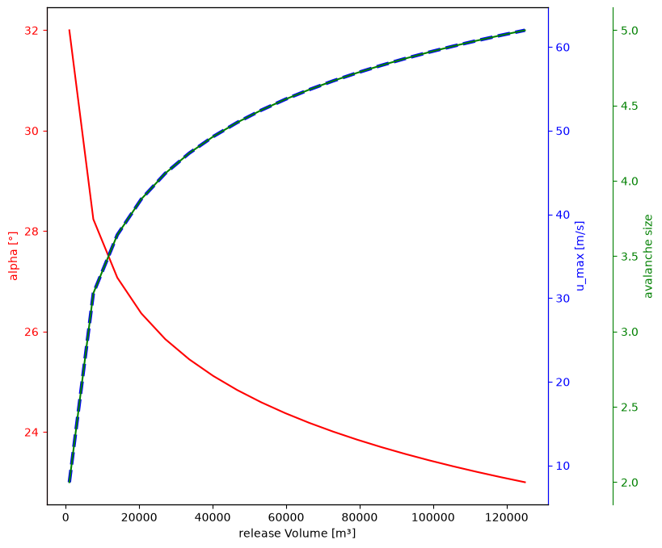
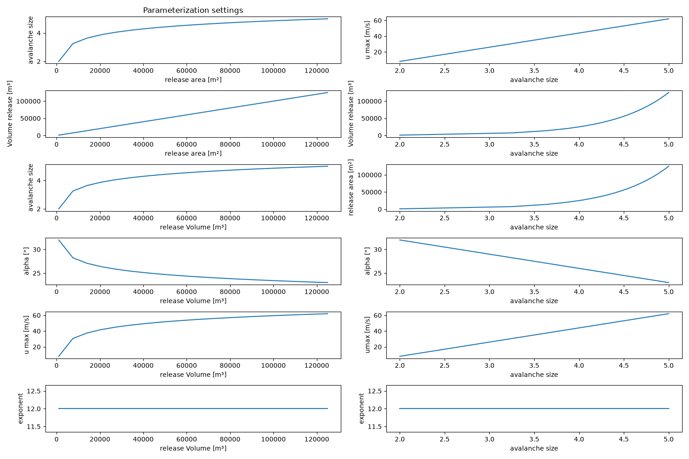

# Module `mod2Mobility`

## Overview

The `mod2Mobility` module provides tools to derive the mobility parameters required by avalanche simulation tools such as [AvaFrame::com4FlowPy](https://docs.avaframe.org/en/latest/moduleCom4FlowPy.html). Conversely, it provides tools to translate `com4FlowPy` simulation results back into an avalanche size for interpretation.

Both operations use the same underlying avalanche-size parameterization, which depends on the release area and, optionally, the local snow climate.

`mod2Mobility` operates on an AvaFrame-compatible `avaDir` containing the standard `Inputs/` and `Outputs/` folders.

For a single-scenario workflow, `avaDir` is the project directory itself:

```text
<avaDir>/
├── Inputs/
└── Outputs/
```

In the multi-scenario workflow, each size and flow-regime directory inside `workFlowDir` is treated as an independent `avaDir`:

```text
<workDir>/<project>/<ID>/
└── 09_flowPyBigDataStructure/
    └── <PRA-case>/
        └── SizeN/
            └── dry|wet/             # individual avaDir
                ├── Inputs/
                └── Outputs/
```

Adding support for using a single-scenario `avaDir` directly as input to `runAvaScenModelChain.py` remains an open development task.

### Workflow Runners

All `mod2Mobility` functions receive an `avaDir`. In the multi-scenario workflow, `workFlowDir` is used to locate the nested leaf directories, and each leaf is then passed to `mod2Mobility` as an individual `avaDir`.

| Workflow runner | `mod2Mobility` function used | Directory passed |
|---|---|---|
| `runDynamicParameterisation.py` | `computeAndSaveParameters` | Single-scenario `avaDir` |
| `runAutoAtesModelChain.py` | `computeAndSaveParameters` | Single-scenario `avaDir` |
| `runThalwegAnalysis.py` | `computeAndSaveParameters` when `runFlowPy = True` | Single-scenario `avaDir` |
| `runAvaScenModelChain.py` | `computeAndSaveParameters` and, optionally, `computeAndSaveSize` | Each nested `SizeN/dry\|wet` leaf `avaDir` discovered through `workFlowDir` |

## `compParams`

The module provides two entry points, implemented in `compParams.py`:

- **`computeAndSaveParameters`**: derives the mobility parameters `alpha`, `umax` and `exp`
  for each release area, to be used as `com4FlowPy` input.
- **`computeAndSaveSize`**: converts `com4FlowPy` simulation results back into an avalanche size raster, to help
  interpret the simulation output.

The underlying relationships are based on the avalanche size classifications
of [EAWS](https://www.avalanches.org/standards/avalanche-size/), [CAA](https://avysavvy.avalanche.ca/en-ca/avalanche-sizes)
and [AAA](https://avalanche.org/avalanche-encyclopedia/avalanche/avalanche-problems/avalanche-size/).

Configuration parameters can be adjusted in `(local_)compParamsCfg.ini`.

---

## `computeAndSaveParameters` — Deriving the Mobility Parameters

For each release area, `computeAndSaveParameters` performs the following steps:

1. Compute the release thickness, either from the snow climate or as a constant value.
2. Compute the continuous avalanche size from the release volume, optionally capped by `sizeMax`.
3. Derive the mobility parameters `alpha`, `umax` and `exp` from the size, optionally shifted by a temperature-dependent
   wet/dry blend.

### 1. Release Thickness

The release thickness can either be set to a constant value (`constantPraThickness = True`), or computed from the snow
climate as a linear function of elevation `z`, using a reference thickness `D0` and a snow-depth gradient
`deltaD`:

```
thickness(z) = D0 + deltaD · z
```

`D0` (thickness at `z = 0`) and `deltaD` (change in thickness per unit elevation, e.g. `10 cm / 100 m` in an Alpine snow
climate) can both be adjusted in the configuration file.

### 2. Release Volume and Avalanche Size

A raster layer containing the release areas (in m²) is required (`Inputs/RELArea`). Given the release area `Arel`
and the thickness from Step 1, the release volume `Vrel` follows as:

```
Vrel = Arel · thickness
```

The avalanche size is the continuous quantity on the same scale as the EAWS/CAA/AAA size classes (from `1` -
`5`). It is linked to this volume through the same empirical relationship as before:

```
Vrel = 5^(size - 2) · 1000
size = 2 + log5( Arel · thickness · 10⁻³ )
```

### 3. Mobility Parameters: `alpha`, `umax`, `exp`

From the avalanche size, the three FlowPy mobility parameters are computed. All three optionally depend on a
temperature-based wet/dry blend of the size, see
[Temperature-Dependent Wet/Dry Parameterization](#temperature-dependent-wetdry-parameterization) below.

#### runout angle `alpha`

`alpha` controls the stopping of the flow path: a smaller `alpha` allows the avalanche to travel farther.

```
alpha(size) = alphaSize2 - (size - 2) · deltaAlpha
```

where `alphaSize2` is `alpha` at `size = 2`, and `deltaAlpha` is the change in `alpha` per unit increase in size. Both
parameters can be adjusted via the corresponding entries in the configuration file.

#### maximum velocity limit `umax`

`umax` (or `umaxlim`) is the upper velocity limit a process can have.

```
umax(size) = uMaxSize2 + (size - 2) · deltaUMax
```

where `uMaxSize2` is `umax` at `size = 2`, and `deltaUMax` is the change in `umax` per unit increase in size. Both
parameters can be adjusted via the configuration file.

#### exponent `exp`

> **Hint:** compared to `alpha` and `umax`, the parameterization of `exp` is used far less and is less
> well understood; treat the formulas below with corresponding caution.

`exp` controls the lateral spread of the flow path: a larger `exp` produces a narrower flow.

```
exp(size) = expCoeff · expBase^size
```

with default values `expCoeff = 75` and `expBase = 0.64`. Both can be adjusted via the configuration file.

If `constantExp = True`, `exp` is set to `constantExpValue`. When temperature dependence is also enabled,
the mean temperature-dependent `sizeShiftExp` is added to this value.

#### Default setting

The figures show the relationships produced by the default settings:




The figures can be created for a custom parameter configuration with:

``` 
python workflows/runPlotParameterisation.py 
```

---

## Wet-Snow Avalanches

For **wet** avalanches, the parameters are derived from the dry-avalanche relationships above, using a shifted avalanche
size:

```
alpha_wet(size) = alpha_dry(size + sizeShiftAlpha)
umax_wet(size)  = umax_dry(size + sizeShiftUmax)
exp_wet(size)   = exp_dry(size + sizeShiftExp)
```

The shifts are configurable via `sizeShiftAlpha`, `sizeShiftUmax` and `sizeShiftExp`. The module configuration defaults
to `sizeShiftAlpha = 0.5`, `sizeShiftUmax = -0.75` and `sizeShiftExp = 0.5`. The workflow configurations currently
override `sizeShiftExp`; this value remains subject to a separate scientific review.

One additional rule applies:

- **Lower bound on `umax`:** any computed value below `5 m/s` is clamped to `5 m/s`.
Avalanche size is capped only when `sizeMax` is configured. In the multi-scenario workflow, the directory builder
separately limits wet-flow scenario folders to size 4 by default.

### Temperature-Dependent Wet/Dry Parameterization

> **Note:** this temperature-dependent parameterization represents an initial idea and has not yet been fully
> tested or validated. It should be verified before operational use.


Rather than a fixed offset between "dry" and "wet" avalanches, `mod2Mobility` can blend between a cold/dry and a
warm/wet parameterization continuously, based on an elevation-derived temperature.

**Temperature profile** (`zToTemp`): temperature is either constant (`constantTemperature = True`, using
`Tcons`), or a linear function of elevation:

```
temp(z) = T0 + deltaT · z
```

clamped between the configured cold and warm limits `TCold` and `TWarm`.

**Shifted size** (`sizeForParameterisation`): for a given parameter (`alpha`, `umax` or `exp`), the size used in that
parameter's formula is shifted linearly between the reference size (at `TCold`, i.e. the "dry" case) and the size plus
the parameter's maximum shift (at `TWarm`, i.e. the fully "wet" case):

```
sizeTemp = size + (temp - TCold) · sizeShift / (TWarm - TCold)
```

where `sizeShift` is `sizeShiftAlpha`, `sizeShiftUmax` or `sizeShiftExp`, respectively.

This shift is always applied for `umax`, and for `exp` in its size-dependent mode; for `alpha` (and for `exp` in its
constant mode) it is applied only if `alphaDependendTemperature = True`.


---

## `computeAndSaveSize`: Avalanche Size from Simulation Results

`computeAndSaveSize` performs the inverse mapping: it converts one or more `com4FlowPy` result rasters back into an
avalanche-size raster, which can help evaluate or interpret simulation results in terms of avalanche size.

The variables to convert are configured via `resParamsToSize` (a `|`-separated list, e.g.
`zDelta|fpTravelAngleMax|travelLength|depVolume`). For each configured variable, the matching `com4FlowPy` output
rasters for the given `avaDir` (and, if provided, `flowPyUid`) are located, and converted as follows (`0` and `-9999`
values in the input raster are treated as nodata):

| `resParamsToSize` entry (aliases, case-insensitive)    | Source raster located | Conversion applied                                                                                                                               |
|--------------------------------------------------------|-----------------------|--------------------------------------------------------------------------------------------------------------------------------------------------|
| `zDelta`                                               | `zDelta`              | `umax`-based inversion: `uMaxSim = sqrt(2 · 9.81 · zDelta)`, then `size = (uMaxSim − uMaxSize2) / deltaUMax + 2`                                 |
| `fpTravelAngleMax`, `fpTravelAngle`  | `fpTravelAngle`       | Inverted via the `alpha(size)` relationship (without the temperature shift): `size = −(alphaSim − alphaSize2) / deltaAlpha + 2`                  |
| `impressure`, `pressure`, `pressureMax`, `impressureMax` | `zDelta`              | Impact-pressure-based **destructive size** (see below): `size = log10(impressure) · 2 − 0.5`                                                     |
| `travelLength`, `travelLengthMax`    | `travelLength`        | Runoutlength-based **runout size** `size = (13 − sqrt(9 − 8·L)) / 2`, with `L = ln(travelLength / 2000) / ln(1.5)` (`travelLengthToRunoutSize`) |
| `depVolume`, `depositionVolume`                        | derived from `*_pathPolygons.geojson` (see below) | Deposition Volume-based **dimension size** (see below): `size = log10(0.1 · depVolume)`, with `depVolume = affectedPath · thickness`         |

Each resulting size raster is written below `Outputs/com4FlowPy/sizeFiles/res_<flowpyHash>/`, with `_sized` appended
to the original filename.

> **Note:** the `zDelta` and travel-angle conversions use the base (cold/dry) `alpha`/`umax` relationships and do
> not account for the temperature-dependent wet/dry shift described above.


The destructive and runout size are computed following the technical scheme described by Fischer et al. (2026, in
prep.). The **destructive size** is derived from the impact pressure that is computed from `zDelta`.

```
pressure = 2 g rho zDelta
```

The density `rho` is derived from the flow regime, up to now, in a dry flow regime, the density is set to 200 kg/m³, in
a wet flow regime the density is set to 400 kg/m³.

> **Note:** In the future, we will compute the density related to the temperature.

The relation `size(impact pressure)` in kPa is derived from the relation impact pressure (size) from Fischer et al.
(2026, in prep.):

```
pressure(size) = 10 ^ (0.5 * size + 0.25) 
```

The **runout size** is derived from the runout length in m (clamped to the range `(0, 3175] m`),
following the relation:

```
runoutLength(size) = runoutLength(size + 1) * 1.5 ^ (size - 6)
```
with `runoutLength(size = 5) = 2 000 m`


The **dimension size** can be characterized by its deposition volume.

The deposition volume is derived from the `*_pathPolygons.geojson` file produced by `com4FlowPy`.
Each polygon's area is rasterized onto the grid of an existing
result raster (`zDelta`, or `travelLength` if `zDelta` is unavailable), which serves only as a reference grid for
extent, resolution and CRS. Where polygons overlap, the cell keeps the **maximum** area among the overlapping
polygons. 

The deposition volume is computed from the affected-path area and an (average) thickness (default
`thickness = 1 m`):

```
releaseVolume = affectedPath · thickness
```

The dimension size is then derived from this volume in m³, following the relation:

```
depVolume = 10 · 10^(size)
```

> **Note, why the *affected* area can be used:** every pixel the avalanche touches,
> in the origin (release), transit and deposition zones, carries roughly `1 m` (in order of magnitude) of snow 
> and this snow is entrained as the avalanche
> passes over it. The total avalanche volume is therefore not just the volume deposited at the end, but results
> from the **entire affected area** multiplied by the snow depth on all of these pixels.`releaseVolume =
> affectedPath · thickness` sums up entrainment along the whole path, not only the final deposition footprint.

> **Note, that the minimum computed size is 1. If the size results in a value < 1, using these equations,
> it is set to 1.
 

---

## Input Files

`computeAndSaveParameters` requires a digital elevation model and a raster containing the release area, provided in the
following structure:

```text
<avaDir>/
└── Inputs/
    ├── digital elevation model (*.tif or *.asc)
    └── RELArea/
        └── release areas in m² (*.tif)
```

`computeAndSaveSize` additionally requires the corresponding `com4FlowPy` result rasters
for the variables listed in `resParamsToSize`. If `depVolume` /
`depositionVolume` is included in `resParamsToSize`, the corresponding `*_pathPolygons.geojson` file must also be
present in the same results folder, together with at least one of the `zDelta` or `travelLength` result
rasters (used only as the reference grid for rasterizing the polygons).

```text
<avaDir>/
└── Outputs/
    ├── com4FlowPy/
        └── peakFiles/
            └── res_<flowpyHash>/   # com4FlowPy simulation results (Step 3)
                └── FlowPy result raster (*.tif or *.geojson)
```

## Output Files

The parameterization files are saved within the following folder structure, so that a dynamic parameterization can be
run with
[AvaFrame::com4FlowPy](https://docs.avaframe.org/en/latest/moduleCom4FlowPy.html#iv-variable-parameters):

```text
<avaDir>/
└── Inputs/
    ├── ALPHA/
    │   └── alpha.tif
    ├── UMAX/
    │   └── umax.tif
    └── EXP/
        └── exp.tif
```

`computeAndSaveSize` saves each converted size raster in the corresponding `sizeFiles` result folder:

```text
<avaDir>/Outputs/com4FlowPy/
└── sizeFiles/
    └── res_<flowpyHash>/
        └── <result>_sized.tif
```

---

Go back to [main documentation](../README.md).